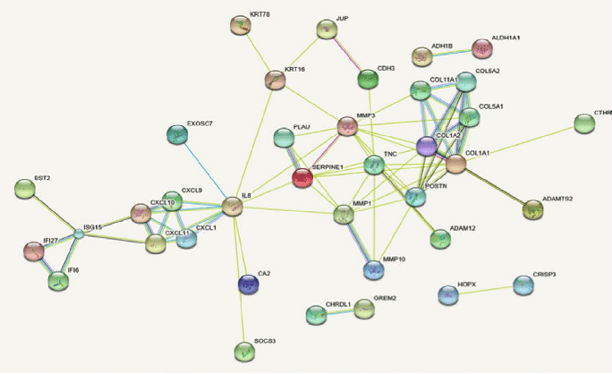

# Protein expression level prediction (Graph Neural Network)

## Business context
    
Protein expression - the process, when hereditary information from the gene (DNA bases sequence) transfer to the final product - protein. Level of expression is protein quantity, transferred in the process. The higher the protein expression, the greater protein quantity arise in human cell's.   

### Task importance
    
There are many reasons to know protein expression level. For example, it helps scietists to develop new drugs and optimize it's process.   

## Dataset
    
Dataset is a protein interaction graph. A node - protein, protein interaction - edge. Level expression is known for each protein. Protein expression levels are splitted into `train` and `test`.

## Data science context
    
Predict protein expression level (`target`) based on datasets. `test` dataset has known `target`.

__Comments:__   

* Graph has one connected component. 
* Huge huns are deleted.
* Graph connection density is decreased.

    
### Metric

`MSE`    

# Author
Parshin Sergei / @ParshinSA / Sergei.A.P@yandex.com
